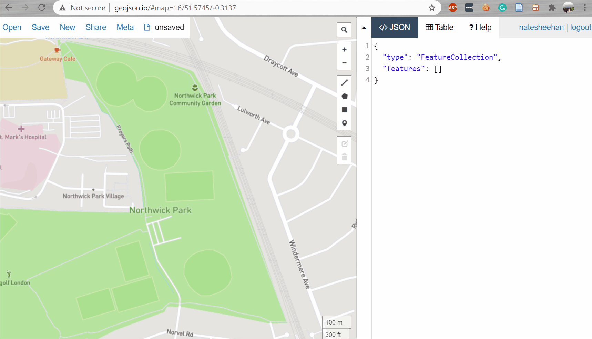
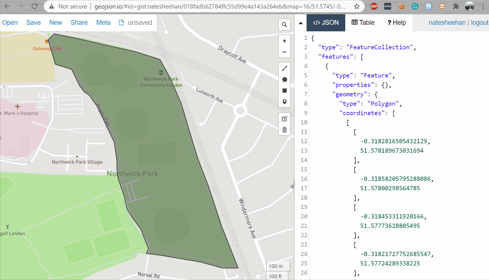
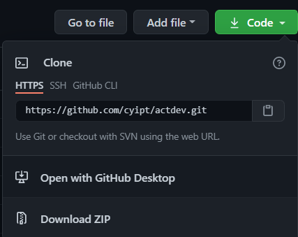
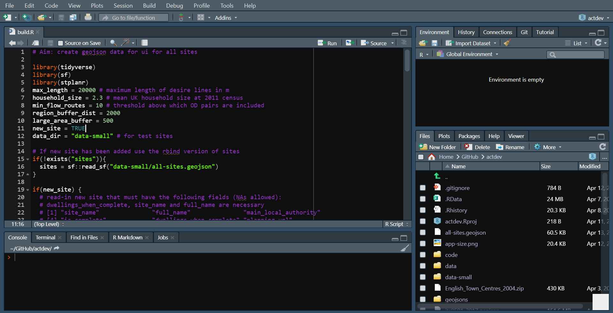

#### Tutorial time: 10 minutes
#### Tutorial difficulty: Easy

# Section 1 Introduction 

[ActDev](https://actdev.cyipt.bike/) is an empirical based web and data tool to enable planners, researchers and the general public to easily calculate active travel provision and potential. The project aims to boost local walking and cycling levels while preventing car dependency. Adding a new site to ActDev can be done even if you don't have experience with computer programming. The following tutorial outlines each step in order to add a new site to the project using R and R-Studio, however, if the mere sight of code and a terminal petrify you, please create an [issue](https://github.com/cyipt/actdev/issues) on our Github and one of our maintainers will happily assist you.


## 1.1 Learning outcomes:

By the end of this tutorial you should be able to:

- Understand the various components involved with ActDev
- Load and undertake analysis for a new housing site
- Push new site data and create a pull request 


## 1.2 Prerequisites:

Before continuing with this tutorial, please ensure you have the following:

- A [https://github.com/](GitHub) account
- R and R-Studio installed on your local machine

*If you are new to R, please follow this [https://rstudio-education.github.io/hopr/starting.html](tutorial)*


## 1.3 Who is the tool for? 

ActDev tools are for **everyone**. ActDev is open source and has a small community of researchers and programmers who maintain it regularly. The ActDev web tool is built for, but not limited to:

- Planners working on new housing developments
- Local governments who are interested in active transport provision of their constituency
- The inquisitive general public who wish to know more about a housing development and active travel in thier local area.


# Section 2 Adding a new site

### 2.1 Outlining a new site with GeoJSON

For those unfamiliar with GeoJSON, it is simply an open standard format which represents simple geographical features and their non-spatial attributes. The ActDev project makes use of GeoJSON in order to automate analysis and visualization. 

In order to add a new site to ActDev, a GeoJSON file matching the ActDev schema is needed. By definition, the ActDev schema is composed of two core elements: ```non-spatial features``` and ```geometry```. An example of the ActDev schema can be found below:

<details>
<summary> <b>Example of ActDev GeoJSON Schema</b> </summary>

```json
{
  "type": "FeatureCollection",
  "name": "new_site",
  "crs": {
    "type": "name",
    "properties": {
      "name": "urn:ogc:def:crs:OGC:1.3:CRS84"
    }
  },
  "features": [{
    "type": "Feature",
    "properties": {
      "site_name": "exeter-red-cow-village",
      "full_name": "Exeter Red Cow Village (Liveable Exeter)",
      "main_local_authority": "Mid Devon",
      "is_complete": "no",
      "dwellings_when_complete": 664.0,
      "planning_url": "https://www.liveableexeter.co.uk/garden-communities/garden-communities/red-cow-village/"
    },
    "geometry": {
      "type": "Polygon",
      "coordinates": [
        [
          [-3.543820381164551, 50.734567435695219],
          [-3.543562889099121, 50.733385886087575],
          [-3.543412685394287, 50.732720402498096],
          [-3.543219566345215, 50.732190725128717],
          [-3.542940616607666, 50.731688205164716],
          [-3.542768955230713, 50.731484479319221],
          [-3.54257583618164, 50.73103627934033],
          [-3.542060852050781, 50.730737476971974],
          [-3.54182481765747, 50.73047941884731],
          [-3.541781902313232, 50.730139866517433],
          [-3.541395664215088, 50.729936133938146],
          [-3.541116714477539, 50.729610159968296],
          [-3.540816307067871, 50.729352095633558],
          [-3.540515899658203, 50.729352095633558],
          [-3.539292812347412, 50.729555830752815],
          [-3.538906574249267, 50.729623742262341],
          [-3.539228439331055, 50.730167030794412],
          [-3.539443016052246, 50.730547329017952],
          [-3.539614677429199, 50.731022697455842],
          [-3.539915084838867, 50.731294334397361],
          [-3.540365695953369, 50.731633878359197],
          [-3.541095256805419, 50.732122817340489],
          [-3.541867733001709, 50.732815472161164],
          [-3.542361259460449, 50.733263655116687],
          [-3.542790412902832, 50.733576022519415],
          [-3.543305397033691, 50.734105684224097],
          [-3.543820381164551, 50.734567435695219]
        ]
      ]
    }
  }]
}
```

</details>
</br>

To kick things off, go to [GeoJSON.io](http://geojson.io/) and create a polygon of your site.




Awesome, we now have the geometry for our site. Next we should add the non-spatial attributes to the properties feature in the GeoJSON. We can do this using the [GeoJSON.io](http://geojson.io/) editor on the right hand side. The non-spatial attributes we need to add are:


```json
"site_name": "name of the site in lowercase, using - as spaces e.g. northwick-park",
"full_name":"full name of the site e.g. Northwick Park Brent",
"main_local_authority": "primary local authority the site is located in e.g. Brent",
"is_complete": "Is site complete, partially complete or not compelete e.g. no|yes|partially",
"dwellings_when_complete": total number of dwellings once the site is complete, not in quotes e.g. 600,
"planning_url": "link to the planning url of the site e.g. https://www.constructionenquirer.com/2021/04/12/planning-for-1000-homes-at-north-west-london-hospital-site/"

```




Finito! Now hover over the save button on the left hand side of [GeoJSON.io](http://geojson.io/) and click on the ```GeoJSON``` option. 


### Step 2) Cloning the ActDev project

The [ActDev](https://github.com/cyipt/actdev) repository obtains all of the scripts and datasets necessary to add a new site. There are various ways to clone the [repository](https://github.com/cyipt/actdev):

- git terminal

```bash
git clone https://github.com/cyipt/actdev.git
```

- GitHub Desktop



Once downloaded, open the ActDev R-Studio project and navigate to the ```build.r``` file. Now, go ahead and move your downloaded GeoJSON file to the ```actdev``` folder.



# Step 3) Run analysis 

ActDev works through an ecosystem of R-Scripts that are respectively run through the ```build.r``` file.

To begin, run this line of code in the R console. This will install all the necessary packages required for analysis.
```{r eval=FALSE}
install.packages("remotes")
cran_pkgs = c("httr", "lwgeom", "mapview", "od", "osmextract", "pct", 
              "remotes", "sf", "stplanr", "sfheaders", "readxl", "zonebuilder", 
              "piggyback", "tmap", "ggplot2", "data.table", "geojsonio", "osmdata", 
              "tidyverse", "cyclestreets", "tmaptools", "spatstat", "rmarkdown", 
              "patchwork", "scales", "colorspace", "jsonlite", "bookdown", 
              "knitr", "xaringan")
remotes::install_cran(cran_pkgs)
remotes::install_github(c("cyipt/acton", "cyipt/actdev", "a-b-street/abstr"))
```

Next, run this code chunk to load the required libraries we just installed and initiate all set up variables for the project. 

```{r eval=FALSE}
# Aim: create geojson data for ui for all sites

library(tidyverse)
library(sf)
library(stplanr)
max_length = 20000 # maximum length of desire lines in m
household_size = 2.3 # mean UK household size at 2011 census
min_flow_routes = 2 # threshold above which OD pairs are included
region_buffer_dist = 2000
large_area_buffer = 500
new_site = TRUE
data_dir = "data-small" # for test sites
```

Next the build.r script loads all existing sites in the ActDev project and saves it to the global enviroment.

```{r eval=FALSE}
# If new site has been added use the rbind version of sites
if(!exists("sites")){
  sites = sf::read_sf("data-small/all-sites.geojson")
}
```

Now its time to load in the GeoJSON file we just created. The following section of code will load the GeoJSON file, transform it to include all columns needed for analysis, and then merge it with the existing data frame of sites. 

*Make sure to change* ```site = sf::read_sf("new_site.geojson")``` *to your filename* 

```{r eval=FALSE}
# If new site has been added use the rbind version of sites
if(!exists("sites")){
  sites = sf::read_sf("data-small/all-sites.geojson")
}

if(new_site) {
  # read-in new site that must have the following fields (NAs allowed):
  # dwellings_when_complete, site_name and full_name are necessary
  # [1] "site_name"               "full_name"               "main_local_authority"   
  # [4] "is_complete"             "dwellings_when_complete" "planning_url"           
  # [7] "geometry"  
  site = sf::read_sf("kergilliack.geojson")
  sf::st_crs(site) = 4326
  site_names_to_build = site$site_name
  path = file.path(data_dir, site_names_to_build)
  dir.create(path)
  new_cols = sf::st_drop_geometry(sites[1, ])
  new_cols = new_cols[setdiff(names(sites), names(site))]
  new_cols[] = NA
  sites = rbind(
    sites,
    sf::st_sf(
      cbind(sf::st_drop_geometry(site), new_cols),
      geometry = site$geometry
      )
  )
} else {
  site_names_to_build = sites %>% 
    filter(str_detect(string = site_name, pattern = "regex-to-rebuild"))
}
```

After completion, you should be able to see your new site at the bottom of the ```sites``` data object.
Before you are able to run the analysis, you will need to run the ```build-setup.r``` script, this will load all of the necessary datasets, libraries and variables needed to run the analysis efficiently. This will take a few minutes, so go put a brew on.

```{r eval=FALSE}
source("code/load_jts.R") # national data if not loaded (takes some time)
source("code/build-setup.R") # national data
```

Following this, the analysis can begin! The first two scripts to run enable OD desire lines, routes and journey time statistics to be calculated for the site and its neighboring LSOAs. This should take a minute or so.

```{r eval=FALSE}
# build aggregate scenarios ----------------------------------------------
set.seed(2021) # reproducibility
disaggregate_desire_lines = FALSE

for(site_name in site_names_to_build) {
  message("Building for ", site_name)
  suppressMessages({
    suppressWarnings({
      source("code/scenarios-streamlined.R")
    })
  })
}

# check the output by uncommenting this line:
# mapview::mapview(desire_lines_many)

# Add jts data ------------------------------------------------------------
for(site_name in site_names_to_build) {
  message("Building for ", site_name)
  suppressMessages({
    suppressWarnings({
      source("code/add_jts.R")
    })
  })
}
```

After completion, you are ready to run the next batch of scripts. However, **do not run** 

```{r eval=FALSE}
# Add json files for abstreet ---------------------------------------------
# should the build process add a background traffic scenario? (WIP)
build_background_traffic = FALSE
# site_directories = list.dirs(data_dir)[-1]
# site_names_to_build = gsub(pattern = "data-small/", replacement = "", x = site_directories)
for(site_name in site_names_to_build) {
  message("Building for ", site_name)
  suppressMessages({
    suppressWarnings({
      source("code/abstr-scenarios.R")
    })
  })
}
```

as this has not been configured for new sites yet. This script builds the required files needed for an [ABStreet](https://github.com/a-b-street/abstreet) simulation. We hope to get this fixed soon.

Moving on, the next batch of scripts to run create zones, infographics, mode-split summary statistics and site metrics for your new site.

```{r eval=FALSE}
# Generate 'clockboard' data ----------------------------------------------

source("code/tests/color_palette.R")

for(site_name in site_names_to_build) {
  message("Building for ", site_name)
  suppressMessages({
    suppressWarnings({
      source("code/clockboard-zones.R")
    })
  })
}

# Generate infographics  ----------------------------------------------

for(site_name in site_names_to_build) {
  message("Building for ", site_name)
  suppressMessages({
    suppressWarnings({
      source("code/infographics.R")
    })
  })
}

# Generate mode split summary  ----------------------------------------------

for(site_name in site_names_to_build) {
  message("Building for ", site_name)
  suppressMessages({
    suppressWarnings({
      source("code/mode-split-summary.R")
    })
  })
}

# Generate in site metrics  ----------------------------------------------

for(site_name in site_names_to_build) {
  message("Building for ", site_name)
  suppressMessages({
    suppressWarnings({
      source("code/in-site-metrics.R")
    })
  })
}


# Populate site metrics for new site --------------------------------------

if(new_site){
  source("code/site-metrics.R")
}
```

Tada! Thats it, analysis complete!. 

In your global environment you should find an object called ```sites_join``` which contains all new sites, including  your new site. The table should be populated with the respective empirical data from the analysis for all sites. 

You should also see a new folder in ```actdev/data-small``` with your sites name.

### Step 3) Create pull request

Given everything has run smoothly, you can now submit a pull-request to add the site to the ActDev project. 

Using either the git terminal or
```bash 
git add -A
git commit -am 'New site: NEW_SITE_NAME'
git push
```
GitHub Desktop push your changes. Once pushed, return back to the [https://github.com/cyipt/actdev/issues](ActDev GitHub) where you should see a **Create Pull Request** button. At this point, one of our maintainers will review your changes and merge the new site if everything is in working order. 

# Section Conclusions

## If things aren't working...

Sometimes things break. This can be annoying, but don't be disheartened we can fix it. If you run into any issues while trying to add a site please create an issue on the [https://github.com/cyipt/actdev/issues](ActDev GitHub) and one of our maintainers will assist you in debugging.

## If things are working...

Congrats! You have contributed to an open source national infrastructure tool which will support active travel uptake. Feel free to add more sites, improvements to the code base, or feature requests on the [https://github.com/cyipt/actdev/issues](ActDev GitHub). 

Once your new site is live, we would be greatful if you could promote through social media and share with us your experience in adding a new site.  


 
