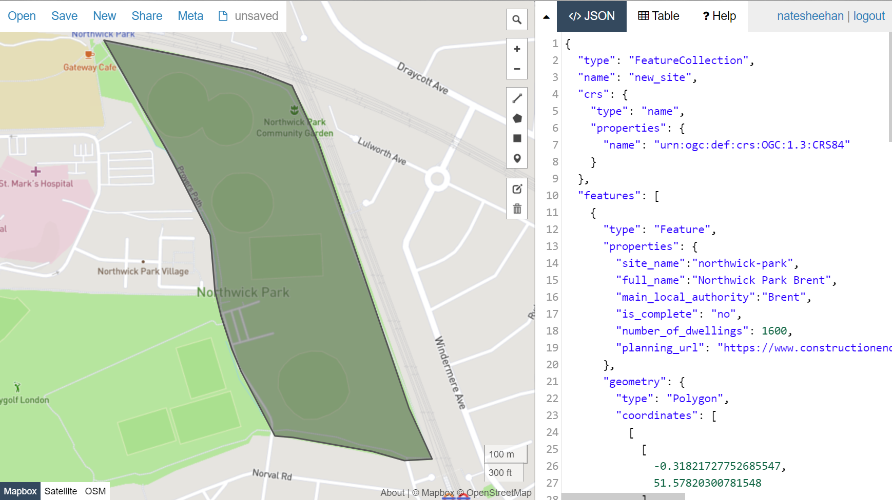

<title> Adding a new site to ActDev </title>

# Adding a new site to ActDev
#### Tutorial time: 10 minutes
#### Tutorial difficulty: Easy

## Section 1 Introduction 

ActDev is an emperical based web and data tool to enable planners, researchers and the general public to easily calculate active travel provision and potential. The project aims to boost local walking and cycling levels while preventing car dependency. Adding a new site to ActDev is truly very simple, even for those without coding experience. The following tutorial outlines each step in order to add a new site to the project using R and R-Studio, however, if the mere sight of code and a terminal petrify you, please create an [https://github.com/cyipt/actdev/issues](issue) on our Github and one of our maintainers will happily assist you.


## 1.1 Learning outcomes:

By the end of this tutorial you should be able to:

- Understand how the ActDev data science Tool functions
- Load and undertake analysis for a new housing site
- Submit a pull request to add the new site to the [https://actdev.cyipt.bike/](ActDev web tool)


## 1.2 Prerequisites:

Before continuing with this tutorial, please ensure you have the following:

- A [https://github.com/](GitHub) account
- R and R-Studio installed on your local machine

*If you are new to R, please follow this [https://rstudio-education.github.io/hopr/starting.html](tutorial)*


## 1.3 Who is the tool for? 

The ActDev tools is for **everyone**. ActDev is open source and has a small community of researchers and programmers who maintain it regularly. The ActDev web tool is built for, but not limited to:

- Planners who are working on new housing developments
- Local governments who are interested in the active transport provision of their constituency
- The inquisitive general public who wish to know more about a housing development, possibly before purchase


## Section 2 Adding a new site

### 2.1 Outlining a new site with GeoJSON

For those unfamiliar with GeoJSON, it is simply an open standard format which represents simple geographical features and their non-spatial attributes. The ActDev project makes use of GeoJSON in order to automate analysis and visualization. 

In order to add a new site to ActDev, a GeoJSON file matching the ActDev schema is needed. By definition, the ActDev schema is composed of three core elements: ```co-ordinate reference system```,```non-spatial features``` and ```geometry```. An example of the ActDev schema can be found below:

<details>
<summary> <b>Example of ActDev GeoJSON Schema</b> </summary>

```json
{
  "type": "FeatureCollection",
  "name": "new_site",
  "crs": {
    "type": "name",
    "properties": {
      "name": "urn:ogc:def:crs:OGC:1.3:CRS84"
    }
  },
  "features": [{
    "type": "Feature",
    "properties": {
      "site_name": "exeter-red-cow-village",
      "full_name": "Exeter Red Cow Village (Liveable Exeter)",
      "main_local_authority": "Mid Devon",
      "is_complete": "no",
      "dwellings_when_complete": 664.0,
      "planning_url": "https://www.liveableexeter.co.uk/garden-communities/garden-communities/red-cow-village/"
    },
    "geometry": {
      "type": "Polygon",
      "coordinates": [
        [
          [-3.543820381164551, 50.734567435695219],
          [-3.543562889099121, 50.733385886087575],
          [-3.543412685394287, 50.732720402498096],
          [-3.543219566345215, 50.732190725128717],
          [-3.542940616607666, 50.731688205164716],
          [-3.542768955230713, 50.731484479319221],
          [-3.54257583618164, 50.73103627934033],
          [-3.542060852050781, 50.730737476971974],
          [-3.54182481765747, 50.73047941884731],
          [-3.541781902313232, 50.730139866517433],
          [-3.541395664215088, 50.729936133938146],
          [-3.541116714477539, 50.729610159968296],
          [-3.540816307067871, 50.729352095633558],
          [-3.540515899658203, 50.729352095633558],
          [-3.539292812347412, 50.729555830752815],
          [-3.538906574249267, 50.729623742262341],
          [-3.539228439331055, 50.730167030794412],
          [-3.539443016052246, 50.730547329017952],
          [-3.539614677429199, 50.731022697455842],
          [-3.539915084838867, 50.731294334397361],
          [-3.540365695953369, 50.731633878359197],
          [-3.541095256805419, 50.732122817340489],
          [-3.541867733001709, 50.732815472161164],
          [-3.542361259460449, 50.733263655116687],
          [-3.542790412902832, 50.733576022519415],
          [-3.543305397033691, 50.734105684224097],
          [-3.543820381164551, 50.734567435695219]
        ]
      ]
    }
  }]
}
```

</details>
</br>

To kick things off, go to [GeoJSON.io](http://geojson.io/) and create a polygon of your site.


Awesome, we now have the geometry for our site. Next we should add the non-spatial attributes to the properties feature in the GeoJSON. We can do this using the [GeoJSON.io](http://geojson.io/) editor on the right hand side. The non-spatial attributes we need to add are:

- ```site_name``` (name of the site in lowercase, using - as spaces)
- ```full_name``` (full name of the site)
- ```main_local_authority``` (primary local authority the site is located in)
- ```is_complete``` (Is the site complete, partially complete, or not complete)
- ```dwellings_when_complete``` (total number of dwellings once the site is complete)
- ```planning_url``` (link to the planning url of the site)


Nearly there! Finally we need to specify a co-ordinate reference system. To do this, you can copy the first nine lines from the schema and paste it at the top of your file just before ```"features": [``` . Once this is done your editor should look something like this:



If it does, great, hover over the save button on the left hand side of [GeoJSON.io](http://geojson.io/) and click on the ```GeoJSON``` option. 

Once your file is downloaded, please refer back to the schema to ensure the file is following the specification. If everything looks good, move the file to the ActDev folder on your local machine.


### Step 2) Cloning the ActDev project

The [https://github.com/cyipt/actdev](ActDev) repository obtains all of the files necessary to add a new site. If you don't have R or R-Studio installed on your machine,  before proceeding. 

You can download the [https://github.com/cyipt/actdev](repository) by either clicking the green ```code``` button or by running ```gh repo clone cyipt/actdev``` in your terminal or command prompt. When the project is download, open it up and navigate yourself to the ```build.r``` file.


### Step 3) Running analysis

To start the analysis run the following section of code, but ensure you change line 25 to the name of your GeoJSON file.

```r
# Aim: create geojson data for ui for all sites

library(tidyverse)
library(sf)
library(stplanr)
max_length = 20000 # maximum length of desire lines in m
household_size = 2.3 # mean UK household size at 2011 census
min_flow_routes = 10 # threshold above which OD pairs are included
region_buffer_dist = 2000
large_area_buffer = 500
new_site = TRUE
data_dir = "data-small" # for test sites

# If new site has been added use the rbind version of sites
if(!exists("sites")){
  sites = sf::read_sf("data-small/all-sites.geojson")
}

if(new_site) {
  # read-in new site that must have the following fields (NAs allowed):
  # dwellings_when_complete, site_name and full_name are necessary
  # [1] "site_name"               "full_name"               "main_local_authority"   
  # [4] "is_complete"             "dwellings_when_complete" "planning_url"           
  # [7] "geometry"  
  site = sf::read_sf("new_site.geojson") # change this to the file name you downloaded from geojson.io
  site_names_to_build = site$site_name
  path = file.path(data_dir, site_names_to_build)
  dir.create(path)
  new_cols = sf::st_drop_geometry(sites[1, ])
  new_cols = new_cols[setdiff(names(sites), names(site))]
  new_cols[] = NA
  sites = rbind(
    sites,
    sf::st_sf(
      cbind(sf::st_drop_geometry(site), new_cols),
      geometry = site$geometry
      )
  )
} else {
  site_names_to_build = sites %>% 
    filter(str_detect(string = site_name, pattern = "regex-to-rebuild"))
}

source("code/build-setup.R") # national data
```

This section will create a new dataframe for the new site and merge it with the existing sites. Following this, it will download all of the datasets required for analysis. This might take a few minutes.

Once this is done, you can run the following code segments. These scripts allow for OD desire lines to be generated and to calculate journey time statsitics for the site and its neighbouring LSOAs. This should take a minute or so.
```r
# build aggregate scenarios ----------------------------------------------
set.seed(2021) # reproducibility
disaggregate_desire_lines = FALSE

for(site_name in site_names_to_build) {
  message("Building for ", site_name)
  suppressMessages({
    suppressWarnings({
      source("code/scenarios-streamlined.R")
    })
  })
}

# Add jts data ------------------------------------------------------------
for(site_name in site_names_to_build) {
  message("Building for ", site_name)
  suppressMessages({
    suppressWarnings({
      source("code/add_jts.R")
    })
  })
}
```

After completion, you are ready to run the next batch of scripts. However, do not run 

```r
# Add json files for abstreet ---------------------------------------------
# should the build process add a background traffic scenario? (WIP)
build_background_traffic = FALSE
# site_directories = list.dirs(data_dir)[-1]
# site_names_to_build = gsub(pattern = "data-small/", replacement = "", x = site_directories)
for(site_name in site_names_to_build) {
  message("Building for ", site_name)
  suppressMessages({
    suppressWarnings({
      source("code/abstr-scenarios.R")
    })
  })
}
```

as this has not been configured for new sites yet.

The next batch of scripts to run are the following:

```r
# Generate 'clockboard' data ----------------------------------------------

source("code/tests/color_palette.R")

for(site_name in site_names_to_build) {
  message("Building for ", site_name)
  suppressMessages({
    suppressWarnings({
      source("code/clockboard-zones.R")
    })
  })
}

# Generate infographics  ----------------------------------------------

for(site_name in site_names_to_build) {
  message("Building for ", site_name)
  suppressMessages({
    suppressWarnings({
      source("code/infographics.R")
    })
  })
}

# Generate mode split summary  ----------------------------------------------

for(site_name in site_names_to_build) {
  message("Building for ", site_name)
  suppressMessages({
    suppressWarnings({
      source("code/mode-split-summary.R")
    })
  })
}

# Generate in site metrics  ----------------------------------------------

for(site_name in site_names_to_build) {
  message("Building for ", site_name)
  suppressMessages({
    suppressWarnings({
      source("code/in-site-metrics.R")
    })
  })
}


# Populate site metrics for new site --------------------------------------

if(new_site){
  source("code/site-metrics.R")
}
```

Upon completion all of the neccesary scripts will have run. In your global environment you should find an object called ```sites_join``` which contains your new site and the respective emperical data from the scripts. You should also see a new folder in ```actdev/data-small``` with your sites name, this folder should contain 31 items. 

With this complete, you are ready to create a PR.

