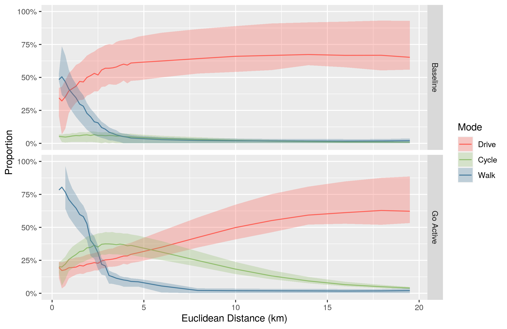
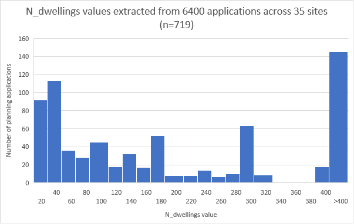

```{r setup, include=FALSE}
knitr::opts_chunk$set(echo = FALSE)
```

```{r, include=FALSE}
options(tinytex.verbose = FALSE)
```

# Introduction

Twin crises of transport and housing

Need for greater integration between planning and transport

Need for early intervention and input to planning process

Potential usership for actionable tools to assess whether new developments will support active travel (academic, planning, advocacy, policy)

Reference Megan Streb's work if possible? (or mention the underlying themes)

# Methods

Describe the prototype tool - adapt text from the report

## Selection of case study sites

As case studies, we chose 35 large residential development sites.
These were selected to represent a diverse range of types of development including urban extensions, urban regeneration schemes and new settlements such as proposed Garden Villages. 
The majority of the sites have been profiled as part of two Transport for New Homes reports; the [Project Summary and Recommendations July 2018](https://www.transportfornewhomes.org.uk/wp-content/uploads/2018/07/transport-for-new-homes-summary-web.pdf) and [Garden Villages and Garden Towns: Visions and Reality](https://www.transportfornewhomes.org.uk/wp-content/uploads/2020/06/garden-village-visions.pdf), providing a wide range of background information. 
In most of these sites construction currently remains in progress, while a small number were completed prior to 2021, and others had not yet reached the construction phase.

## Planning data

[UK Planit](https://www.planit.org.uk) is a national database of planning applications based on scraping and aggregating data from the websites of more than 400 planning authorities. 
The ability to make use of this full national dataset allows analysis of planning data in ways that were not previously possible.

Planning applications relate to a wide range of activity. 
There was no standardised indication of the type or size of a development which is being planned.  
Consequently an ‘app_size’ classification was added to the the PlanIt database with the aim of flagging large scale strategic residential developments as ‘Large’ and other residential developments with >10 dwellings as ‘Medium’. 

The classification rules for ‘app_size’ used three sources of indirect proxy indicators for larger scale developments: 

1. The number of documents associated with the application (more than 100 indicating a larger development), 

2. The number of days before a decision is taken (more than 8 weeks indicating wide community interest), 

3. And the type of an application (environmental impact assessments often being associated with large developments). 

Using these three indicators a crude classification was made, although it was known that many applications of interest were being missed.

We used our 35 case study sites to further improve the derivation of the ‘app_size’ field within PlanIt. 
All planning applications within the 35 areas were reviewed and compared against existing classifications and known missing cases. 
From this it was noted that many such applications included key words (such as ‘garden village’) and often a number of prospective residences in the ‘description’ field (eg ‘2,300 new mixed-tenure dwellings’). 
Subsequently a new set of rules was developed within PlanIt to extract the key words and a new ‘n_dwellings’ field. 
These were then used as additional proxy indicators of development scale within the process for deriving the ‘app_size’ classification (specifically ‘n_dwellings’ more than 40 indicating ‘Large’ and more than 10 indicating ‘Medium’).

## Demographic and travel data

In the UK, the best available travel information at high levels of geographic resolution is the 2011 Census travel to work origin-destination (OD) data, which formed a foundation of the analysis.
Travel to work accounted for [around 20%](https://assets.publishing.service.gov.uk/government/uploads/system/uploads/attachment_data/file/877039/commuting-in-england-1988-2015.pdf) of total UK travel by distance before the coronavirus pandemic led working from home levels to increase from around 5% to 40% of the workforce.
We used MSOA data to demonstrate the methods although higher resolution data could be used.

Converting the OD data to desire lines, we used their Euclidean distances and number of journeys to demarcate a study area around each site. 
The study area incorporated all desire lines with length <= 20 km where the number of journeys by foot, bicycle and car/van drivers met a threshold value. 
The threshold value was set as the $t = n / 250$ where t is the threshold value and n is the number of dwellings when complete within the site.

## Disaggregation of OD data

Zone centroids are often used as journey start and end points for the mapping of OD data (PCT ref).
However, in reality each journey has a unique origin and destination. 
The use of zone centroids distorts the mapping of travel patterns, artificially causing journeys to aggregate to a limited number of routes.
This is particularly problematic when mean journey lengths are relatively short in relation to the size of the zones being used, such as for journeys by foot.

We developed new methods to disaggregate origin-destination data, enabling multiple origins and destinations within a single MSOA zone, as illustrated in Figure \@ref(fig:disag) below.
To do this, we located the buildings within each zone, and assigned journey start and end points to a random selection of these buildings.
For cases where buildings were absent from OSM but residential roads were present, we automatically generated buildings along the residential roads.
This disaggregation method was used for all case study sites having < 20 desire lines within their study area.

<!-- ```{r disag, fig.cap="Desire lines for commuter journeys from Leeds Climate Innovation District, following disaggregation of origin-destination data to represent multiple origin and destination points within each MSOA zone"} -->
<!-- knitr::include_graphics("https://user-images.githubusercontent.com/1825120/110860616-e608e980-82b4-11eb-815e-6ee51bb4f6f6.png") -->
<!-- ``` -->

## Journey routing and road characteristics

Having obtained data on commute modes of travel and assigned appropriate destinations, we then identified routes for these journeys.
For all desire lines lying within the study area around each site, we generated cycling and walking routes for the journeys to work.
We also combined the individual routes into a series of route networks. 

For cycle journeys to work, we used a set of algorithms created by [CycleStreets.net](https://www.cyclestreets.net/).
Three routing options are available, representing fast, balanced and quiet routes.
For the fast routes, journey times are minimised.
For the quiet routes, a 'quietness' parameter is maximised, to avoid routes that follow busy roads.
The balanced routes represent an intermediate between the fast and quiet approaches.  
Factors assessed during the routing include road type, cycle path width and surface quality, barriers and obstructions, signage and route legibility, among others (https://www.cyclestreets.net/api/v1/journey/).
The gradient of route segments is also taken into account.

It is useful to have these three different versions of the cycle routes, because this can reveal places where for example a direct road may link to a destination, but may be too busy for most people to consider cycling along it.
If the 'quiet route' to a given destination is considerably longer than the 'fast route', it suggests that the introduction of dedicated cycle infrastructure along the line of the fast route would likely help to improve cycle accessibility.

For journeys to work on foot, we used the [Open Source Routing Machine](http://project-osrm.org/) (OSRM) routing engine.

In addition to the commuter journeys, we also generated routes for journeys from each site to the nearest town centre.
This included both walking and cycling routes, as long as the town centre was within 6 km of the site.
There is no data available on the number of journeys residents make to their nearest town centre, however we know from the [National Travel Survey](https://www.gov.uk/government/statistical-data-sets/nts04-purpose-of-trips) that across England in 2018/19, 15% of journeys were for commuting, 19% were for shopping, 8% were for sport/entertainment, 9% were for personal business, and 5% were for visiting friends (but not at a private home).
Many of these journeys are likely to involve going to the town centre, either as a destination or as a means of accessing further travel.
We therefore made a simple assumption that the number of journeys to the nearest town centre are equal to the total number of commuter journeys from a site.

The generation of the routes allows estimation of parameters such as route length, duration, mean busyness, maximum busyness, mean gradient and maximum gradient. 
The next step was to combine the routes into a route network.
We produced separate route networks for walking routes, fast cycle routes, balanced cycle routes, and quiet cycle routes.
With these we can see the total number of journeys on each road segment, which can be analysed alongside segment level data on road busyness and gradient. 

## Mode shift scenarios

For each site, we generated two scenarios, Baseline and Go Active, as illustrated in Figure \@ref(fig:scenario-overview).
The 2011 Census journey to work data represents baseline conditions. 
For the Baseline scenario, we simply adjusted this data to represent the population, at completion, of the chosen residential development site, rather than the population of the MSOA(s) that the site lies within.
For any given OD pair and mode: 
Baseline trips = 2011 Census trips from local MSOA(s) / 2011 MSOA population(s) * Number of dwellings at completion * Mean household size
The data for MSOA population(s) and mean household size both represent total population, rather than population of working age.

The Go Active scenario represents the potential for increased uptake of walking and cycling, in the presence of high quality infrastructure and sustained investment.
We calculated this increased uptake purely in terms of a switch from car/van driving to walking or cycling.
Other modes of travel such as bus and rail were kept constant, and no change was made to journeys that already took place by foot or bicycle in the Baseline scenario.
We also assumed that the journey destinations and the total volume of travel remains the same as in the Baseline scenario.

To generate the increased cycle uptake in Go Active, we used the 'Go Dutch' cycling uptake function from the [Propensity to Cycle Tool](https://www.pct.bike/).
This represents the proportion of journeys that would be undertaken by bicycle if cycle mode share corresponded with average cycling levels in the Netherlands.
This function controls for route length and hilliness.

To generate the increased walking uptake in Go Active, we used a set of simple estimations.
For journeys <= 2.0 km in length we assumed a walking mode share 30% above baseline levels; for journeys of 2.0 - 2.5 km length, walking mode share was increased by 20%; for 2.5 - 3.0 km by 10%; and for 3.0 - 6.0 km by 5%.
In future work we plan to refine the uptake model, which is illustrated in Figure \@ref(fig:scenario-overview).

```{r scenario-overview, fig.cap="Overview of the uptake model underlying the Go Active scenario compared with the Baseline scenario which is based on data from the 2011 Census. The bands represent the range within which the majority of origin-destination pairs fall, from the 20th to the 80th percentile.", out.width="80%"}
# knitr::include_graphics("https://raw.githubusercontent.com/cyipt/actdev/main/data-small/scenario-overview.png")

```

## Within-site metrics

The measures discussed so far relate to journeys to work or to other destinations.
The majority of the length of these journeys will take place outside the boundaries of any particular new residential development.
However we also wanted to investigate the internal layout of the sites themselves.
In particular, the circuity of routes within a site can reveal features relating to the design of the site.
The comparative circuity of routes by foot, by bicycle and by car can be assessed.

To do this, we generated cycling, walking and driving routes for a set of journeys between 20 random points within each site.
We routed these journeys using OSRM.
Having obtained the sets of random points, we first generated the driving journeys, then reset the exact origin and destination points based on the results of this routing.
This constrained the points to be on the road network itself, preventing cycle and walking route origins and destinations from spawning on footpaths.

# Results

## Planning data

PlanIt Large applications nationwide

The PlanIt API enables nationwide analysis of planning application data. 
Across the UK, the PlanIt web scraper identifies 15.7 million applications from over 400 Local Planning Authorities.
Using the new 'app_size' definition, we have classified 1.3% of these as Large.
Within the geographical bounds of the 35 case study sites we found 6400 planning applications, of which 11% are classified as Large. 

The changes we made to the 'app_size' classification raised the proportion of ‘Large’ applications within our case study sites from 3% to 11% and reduced ‘Medium’ applications from 10% to 8%.

The distribution of ‘n_dwellings’ values found in the sample of 6400 applications is illustrated below.

```{r large-apps, fig.cap="Number of dwellings identified in planning applications within the 35 case study sites"}
# knitr::include_graphics("https://raw.githubusercontent.com/cyipt/actdev/main/large-apps.png")

```

The results of changes to the method of assigning 'app_size' are shown below, for planning applications within our 35 case study sites.

```{r app-size, fig.cap="Classification of the size of planning applications within the 35 case study sites"}
# knitr::include_graphics("https://raw.githubusercontent.com/cyipt/actdev/main/app-size.png")
knitr::include_graphics("../../app-size.png")
```

## Travel in the wider area around a site

Baseline travel patterns

Some of our case study sites were already partially complete by that date, meaning the MSOA data reflects, in part, the actual journeys of site residents themselves.
However, in most cases the census data is best seen as an indication of travel patterns in the local area surrounding a site, rather than a reflection of the site itself.

Potential for change

Zoned (and overall) route-based measures of circuity and cycleability / walkability 

LTN mapping?

## Travel in the site itself

In-site circuity

Links across site boundary

# Discussion

Importance of location

Importance of site design

Importance of time

Additional analysis possible 
- POIs

# Conclusion

open source