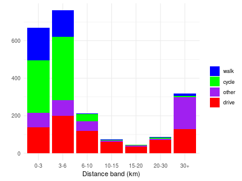
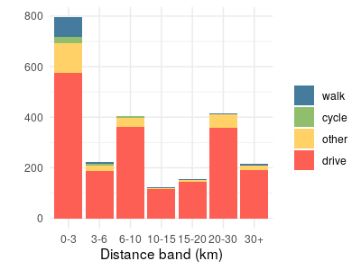
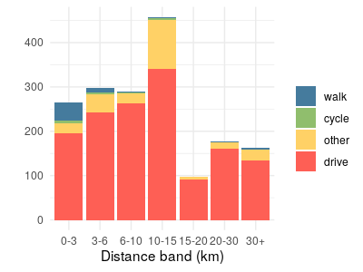
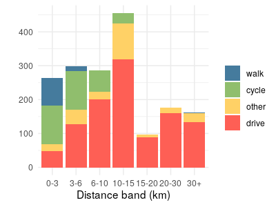
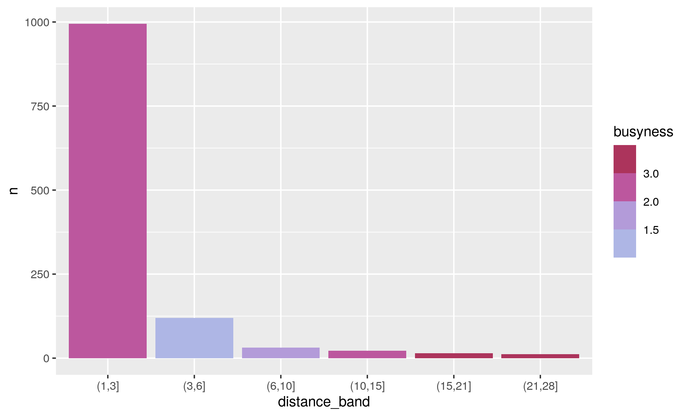
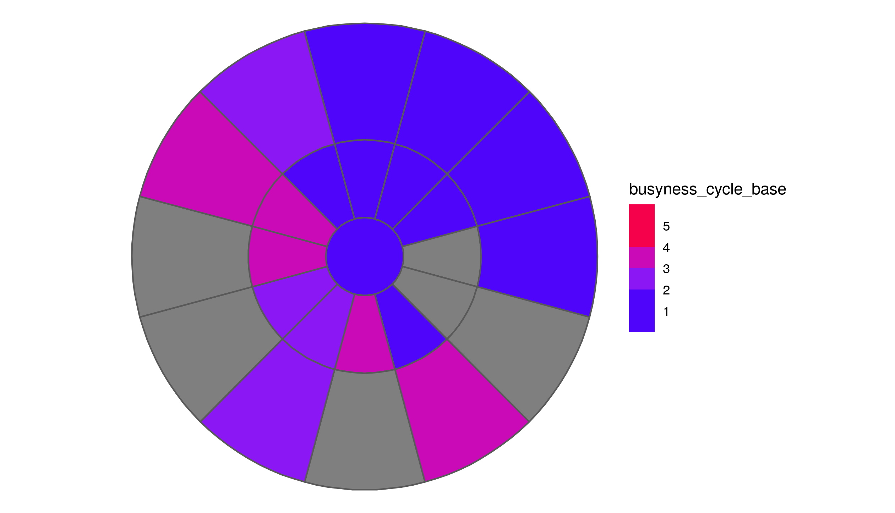
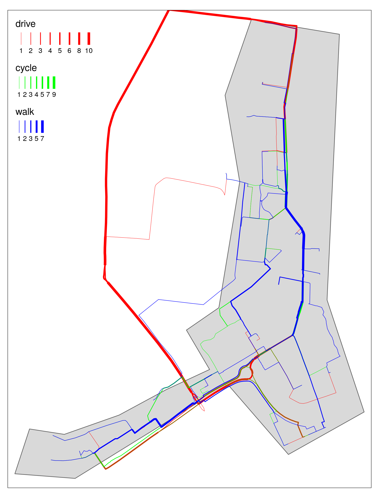

```{r setup, include=FALSE}
knitr::opts_chunk$set(echo = FALSE)
```

# Introduction

bringing together 4 datasets

## The need for the tool

Two key challenges - sustainable transport and housing crisis.

Human health, decarbonisation, air pollution and the need to increase walking and cycling.

Need for affordable housing
State of new homes in England
TfNH reports
Moving in the wrong direction, towards car dependency.

## Policy landscape

White paper
Gear change and LTN1/20
Housing algorithm thrown out
5 year housing land supply and the Call For Sites process
Site sustainability assessments

## Aims and objectives

We aimed to create a tool which:

a) Provides a rating for the level of active travel provision (cycling and walking) between development sites and key services, to determine whether a location would be or is acceptable from health perspectives.

b) For known planned/existing development sites, the tool will provide additional analysis to inform specific improvements that could be made in active travel provision and proximity of key services within walking and cycling distance.

c) makes the case for further work to create an interactive web application (including the underlying evolving evidence base) to do the above but on a national scale.

# Project Components 

## Planning data

Use Andrew's text

Choice of case study sites
Site populations, state of completion - reference TfNH

Use of 35 sites to pin down PlanIt large criteria  

## Access to local services

When choosing a development site, a key consideration is proximity to local services such as shops, schools, parks, and other community facilities.
Nationally, access to a range of services has been quantified through the Department for Transport's Journey Time Statistics(link). 
These record the average journey times to the closest food store, primary school, secondary school, further education college, pharmacy, GP surgery, hospital, and town centre, at the Lower Super Output Area (LSOA) level.
These LSOA level averages are derived from the mean of the journey times from each Output Area within the LSOA.

Journey times are computed by three modes.
The first mode uses a combination of walking and public transport, depending on which of these is fastest.
The second mode is cycling, and the third is driving.
Using these statistics, we can get a picture of which locations allow easy access to local services by walking and cycling.
We can also compare these journey times to journey times by car.

The JTS data does have some limitations. 
There is no information on the quality of the route.
For example, a fast cycling route may be possible along a busy road, but in practice this might not be a feasible route for most people.
Similarly, we cannot differentiate between a well-used high frequency bus service and an expensive, occasional service.

A further limitation is that the JTS data comprises LSOA-level averages, so will not necessarily be representative of a given locality within that LSOA. 
To get data that better matches a particular development site, we have also written code to abstract chosen points of interest from OpenStreetMap (OSM).
For example, we can identify all of the supermarkets on OSM that are close to a given site, and calculate journey times from the site to these known destinations. 

Town centres are a key destination, visited for a wide range of purposes such as shopping, leisure, entertainment, employment, personal business and to access onward travel.
Using the same 2004 town centre dataset as is used in the JTS statistics, we can identify the closest town centre to a given site. 

Travel to work is one of the most frequent journey purposes. 
We have high degree of knowledge of employment locations through the use of census data, as described in the following section. 

## Demographic and travel data

Travel to work comprises x% of total travel (ref).
These journeys form the core of our investigation, because, unlike most other journey types, the origins and destinations are comprehensively understood and recorded, with complete national coverage, in the 2011 Census (ref).
We used commute data which disaggregates the points of origin and destination as OD pairs at the Medium Super Output Area (MSOA) level.
As well as the geographic location of origin and destination we can also determine the journey distance, and crucially, information is available on the mode of travel.
Thus we can estimate the average distance of travel to work, and the proportions of residents who commute by walking, cycling, driving, or other modes.

The latest census was conducted in 2011.
Some of our case study sites were already partially complete by that date, meaning the MSOA data reflects, in part, the actual journeys of site residents themselves.
However, in most cases the census data is best seen as an indication of travel patterns in the local area surrounding a site, rather than a reflection of the site itself.

An MSOA can cover a wide area, especially in rural areas. 

Issues with the stats and mode share can arise from this (eg Wynyard; Cambridge - Great Kneighton v Trumpington Meadows)

We chose to focus on three modes of travel - walking, cycling and car/van driving.
Walking and cycling represent active travel.
Car/van driving is the most frequent mode of travel across the UK, and one of the most damaging in environmental and health terms.
A key policy aim is to replace journeys by car/van with walking or cycling.

Generation of large and small study areas.
From OD pairs to desire lines.
Limitation of restricting analysis to these study areas.

## Journey routing and road characteristics

Having obtained data on commute destinations and modes of travel, the next step is to identify the routes on the local road network that we expect these journeys to follow.
For all desire lines lying within the large study area around each site, we generated cycling and walking routes for the journeys to work.
We also combined the individual routes into a series of route networks. 

For cycle journeys to work, we used a set of algorithms created by CycleStreets.net(link).
Three algorithms are available, representing fast, balanced and quiet routes.
For the fast routes, journey times are minimised.
For the quiet routes, a 'quietness' parameter is maximised, to avoid routes that follow busy roads.
The balanced routes represent an intermediate between the fast and quiet approaches.  
Factors assessed during the routing include road type, cycle path width and surface quality, barriers and obstructions, signage and route legibility, among others (https://www.cyclestreets.net/api/v1/journey/).
The gradient of route segments is also taken into account.

It is useful to have these three different versions of the cycle routes, because this can reveal places where for example a direct road may link to a destination, but may be too busy for most people to consider cycling along it.
If the 'quiet route' to a given destination is considerably longer than the 'fast route', it suggests that the introduction of dedicated cycle infrastructure along the line of the fast route would likely help to improve cycle accessibility.

For journeys to work on foot, we used the Open Source Routing Machine (OSRM) routing engine.....

In addition to the commuter journeys, we also generated routes for journeys from each site to the nearest town centre.
This included both walking and cycling routes, as long as the town centre was within 6 km of the site.
There is no data available on the number of journeys residents make to their nearest town centre, however we know from the [National Travel Survey](https://www.gov.uk/government/statistical-data-sets/nts04-purpose-of-trips) that across England in 2018/19, 15% of journeys were for commuting, 19% were for shopping, 8% were for sport/entertainment, 9% were for personal business, and 5% were for visiting friends (but not at a private home).
Many of these journeys are likely to involve going to the town centre, either as a destination or as a means of accessing further travel.
We therefore made a simple assumption that the number of journeys to the nearest town centre are equal to the total number of commuter journeys from a site.

The generation of the routes allows estimation of parameters such as route length, duration, mean busyness, maximum busyness, mean gradient and maximum gradient. 
The next step was to combine the routes into a route network.
We produced separate route networks for walking routes, fast cycle routes, balanced cycle routes, and quiet cycle routes.
With these we can see the total number of journeys on each road segment, which can be analysed alongside segment level data on road busyness and gradient. 

Simon's LTN work

## Mode shift scenarios

For each site, we generated two scenarios, Baseline and Go Active.
The 2011 Census journey to work data represents baseline conditions. 
For the Baseline scenario, we simply adjusted this data to represent the population, at completion, of the chosen residential development site, rather than the population of the MSOA(s) that the site lies within.
For any given OD pair and mode: 
Baseline trips = 2011 Census trips from local MSOA(s) / 2011 MSOA population(s) * Number of dwellings at completion * Mean household size
The data for MSOA population(s) and mean household size both represent total population, rather than population of working age.

The Go Active scenario represents the potential for increased uptake of walking and cycling, in the presence of high quality infrastructure and sustained investment.
We calculated this increased uptake purely in terms of a switch from car/van driving to walking or cycling.
Other modes of travel such as bus and rail were kept constant, and no change was made to journeys that already took place by foot or bicycle in the Baseline scenario.
We also assumed that the journey destinations and the total volume of travel remains the same as in the Baseline scenario.

To generate the increased cycle uptake in Go Active, we used the 'Go Dutch' cycling uptake function from the Propensity to Cycle Tool (ref). 
This represents the proportion of journeys that would be undertaken by bicycle if cycle mode share corresponded with average cycling levels in the Netherlands.
This function controls for route length and hilliness.

To generate the increased walking uptake in Go Active, we used a set of simple estimations.
For journeys <= 2.0 km in length we assumed a walking mode share 30% above baseline levels; for journeys of 2.0 - 2.5 km length, walking mode share was increased by 20%; for 2.5 - 3.0 km by 10%; and for 3.0 - 6.0 km by 5%.
*check how this works*
This is not data-driven but is simply an estimation. 

## Within-site metrics

The measures discussed so far relate to journeys to work or to other destinations.
The majority of the length of these journeys will take place outside the boundaries of any particular new residential development.
However we also wanted to investigate the internal layout of the sites themselves.
In particular, the circuity of routes within a site can reveal features relating to the design of the site.
The comparative circuity of routes by foot, by bicycle and by car can be assessed.

To do this, we generated cycling, walking and driving routes for a set of journeys between 20 random points within each site.
We routed these journeys using OSRM.
Having obtained the sets of random points, we first generated the driving journeys, then reset the exact origin and destination points based on the results of this routing.
This constrained the points to be on the road network itself, preventing cycle and walking route origins and destinations from spawning on footpaths.

## Traffic simulation

A/B street as a tool for planning, education and exploration.

# Findings

The 35 case study sites encompass a wide range of development types, from urban redevelopment schemes to suburban infill, urban fringe expansion and entirely new settlements. 
The scale of these developments also varies considerably. 
Most of the chosen sites will have over 1000 homes on completion, with up to 6900 at Hampton near Peterborough, but some are smaller, the smallest being Tyersal Lane with only 270 new homes.
At least three of the sites are now entirely complete and another 24 are mostly or partly complete.
In eight sites construction has not yet begun, and for these sites we have not generated any in-site metrics.

Table of site completion, number of dwellings and LA.

## Existing travel patterns in the vicinity of the 35 case study sites

Unsurprisingly, existing travel patterns in the vicinity of these sites vary greatly.
The variation in commuter journeys is captured by the 2011 Census data as used in our Baseline scenario.
It must be recognised that these data represent travel patterns in the areas surrounding the sites, rather than specifically for the sites themselves.
The data are aggregated at the MSOA level (these are zones with a mean population of around 7800), so even for sites which were partially complete in 2011 the Baseline data is derived from a wide zone which stretches beyond the site boundaries. 
With this caveat in mind, the differences in existing travel patterns show some revealing patterns.

Walking mode share for these journeys varies from 3% at Upton and Dickens Heath to 39% at Bath Western Riverside, with a mean of 11.4%.
Cycling mode share is as low as 1% at nine, mainly rural, sites. 
The mean value is 4.3% and the maximum is 31%, at Great Kneighton in Cambridge.

Driving mode share has a mean value of 65.5%. 
At five sites driving mode share is > 80%, and four of these (Dickens Heath, Chapelford, Wynyard and Upton) are sites in which some of the homes are known to have been occupied prior to 2011.
Only at five sites is driving mode share < 50%.
These are all urban sites, with Kidbrooke Village (our only London site) having the lowest driving mode share at 30%.

In terms of other modes of travel, Kidbrooke Village also has the highest mode share for rail, and is one of only three sites - all in or near London - having rail mode share > 10%.
Bus mode share ranges from 1% at Tresham to 17% at Leeds Climate Innovation District, with a mean of 5.5%.
Four of the seven sites with highest bus mode share are in Leeds.
The average mode share for other modes of travel, including car/van passengers, motorbike and taxi, is 7%. 

We expect to see a strong relationship between the distance travelled to work and the mode of travel.
For the vicinity of each site, we used the 2011 Census data to calculate the median commute distance.
This ranges from 1.7 km at Taunton Firepool to 16.0 km at Culm Garden Village, with a mean of 7.9 km.

Combining the commute modes and distances, and using a standardised set of distance bands, we can further interrogate the travel to work data, as seen in Figure xx. 
In this figure we compare commutes at Great Kneighton with those at Chapelford.
We can see that walking and cycling mostly occurs in the shorter distance bands. At Chapelford the median commute distance is higher than at Great Kneighton, and active modes also comprise a smaller proportion of the short journeys.

```{r}
# knitr::include_graphics("https://user-images.githubusercontent.com/1825120/109196812-19675680-7794-11eb-88c6-05ed58365f6e.png")


```

Show route and route network maps for commutes only, with line width representing usage, and a single colour.

## How case study sites compare with existing residential areas

Compare sites to older areas and to local/regional/national averages.

Why do they differ? 
- Urban/rural divide
- existing travel patterns
- site design
- surrounding area design
- lack of connectivity 
- lack of walkable destinations etc

## Travel to town centres

Measured on the fast cycle route network, the median distance from our case study sites to the nearest town centre is 3.2 km.
Just three sites lie within 2.0 km of the nearest town centre.
At ten sites the nearest town centre is >5.0 km away, the longest being Tresham Garden Village *check this* with a distance of 23.9 km. 
It must be recognised that some smaller towns may be excluded from our town centre dataset, so a degree of local knowledge is useful in interpreting these data.

Distance to town centre - histogram

## Potential improvements for active travel - The Go Active scenario

Assuming existing travel patterns remain the same, in terms of the locations of workplaces or other destinations, a key question is what proportion of these journeys could theoretically switch from car/van driving to walking or cycling? 
The answer will vary from site to site, depending mainly on the distances from people's homes to the destinations of interest.
Estimating this allows us to understand the potential usership of new walking or cycling infrastructure, if sustained investment was made in high quality active travel provision.
It lets us see how much walking and cycling uptake there could be under the right circumstances.
We can also see which sites are already close to reaching these high levels of active travel, and which remain far away from them.
If existing walking and cycling levels are far below their potential, this suggests there may be particular barriers that need further investigation.

The proportion of commutes by foot under our Go Active scenario ranges from 0% to 48%, with a mean of 12%. 
It is zero in four sites because in these places we identify no journeys less than 6km in length, which is our maximum threshold distance for walking.
These are typically remote rural locations where new settlements have been proposed or constructed.
There are three urban sites - Bath Western Riverside, Taunton Firepool and Leeds Climate Innovation District - which see > 40% of commutes by foot in this scenario.

Commutes by bicycle in the Go Active scenario range from 5% at Ashton Park and Tresham Garden Village to 63% at Great Kneighton in Cambridge.
The site with the second highest value, also in Cambridge, sees 36% of commutes by bicycle.
The mean proportion of cycle commuting in this scenario is 18%.
The proportion of commutes by car/van drivers is typically lower in Go Active than in the Baseline scenario. 
It has a mean of 52%, ranging from 18% at Kidbrooke Village to 83% at Tresham Garden Village.
We do not model changes in other modes of travel.

Studying the differences between the Baseline and Go Active scenarios, we can see where there is potential for substantially increased increased uptake of walking and cycling, given the right circumstances.
Of the 35 sites, the one with the greatest proportional increase in walking from Baseline to Go Active scenario, is at Chapelford, where walking mode share increases 250%, from 4% to 10%. 
This suggests that in 2011, the proportion of people walking at Chapelford was well below potential.  
Proportional increases in cycling between the two scenarios are much greater than for walking. 
The greatest proportional increase in cycling, from the Baseline to the Go Active scenario, is at Dickens Heath, where cycling mode share increases 2000%, from 1% to 20%.
The mean proportional increase in cycling across all sites is 700%.

Figure xx shows the Baseline and Go Active scenarios for Dickens Heath. We can see that in 2011, 82% of commutes here were by car/van drivers, but many of these could potentially switch to cycling, if sufficient investment was made into safe, convenient cycle routes. 

```{r}
# knitr::include_graphics("https://rstudio.robinlovelace.net/s/5c3af025296bd766026a1/files/actdev/data-small/allerton-bywater/mode-split-goactive.png")


```

Proportion of car/van drivers that switch modes under Go Active - explain mapped v total %.
Impact of site size and the reason for estimating active travel mode shift outside the study area.
Explain that this isn't included in the infographics.

Active travel mode share Baseline v Go Active. 
XY plot of baseline and Go Active mode shares

Driving mode share Baseline v Go Active
XY plot of baseline and Go Active mode shares

Why do some sites see greater absolute or relative change than other sites? (% of short journeys? % who travel by other modes?)
Explain that we don't capture everything, just potential for mode shift from driving.

## Barriers and opportunities for increased active travel uptake

Circuity and busyness of routes to key destinations

Why is this important?
Residents put off walking or cycling if they can't find a route where they feel safe, or if such routes are much longer and slower than it would be to drive.

Show route and route network maps, with colour representing busyness.

Explain the clockface graphics

```{r}
# knitr::include_graphics("https://user-images.githubusercontent.com/1825120/108995587-3832f380-7695-11eb-97ca-bbc1fce12a15.png")

```

Busyness

```{r}
# knitr::include_graphics("https://rstudio.robinlovelace.net/s/5c3af025296bd766026a1/files/actdev/data-small/allerton-bywater/gg_busyness_dartboard.png")


```

## Site layouts and the permeability of site boundaries

Compare in-site circuity of the 3 modes.

```{r}
# knitr::include_graphics("https://user-images.githubusercontent.com/1825120/108996661-8f859380-7696-11eb-9b52-e03ff658ce1c.png")


```

Crossing points along site boundary

# The web tool

## Intended audience

Users can typically be broken down into three groups:

1) Those interested in planning and transport policy issues at a national level, such as Central Government officers.

2) Those interested in planning and transport issues at a local or regional level, including policy implementation, site establishment and site assessment. 
This may include Local Government officers, developers and consultants.

3) Campaigners and advocates.

## National level

## Site level

Describe the interface components

## A/B street interface

Describe the key features.

# Conclusion

## Next steps

A 2 page scoping of the next steps